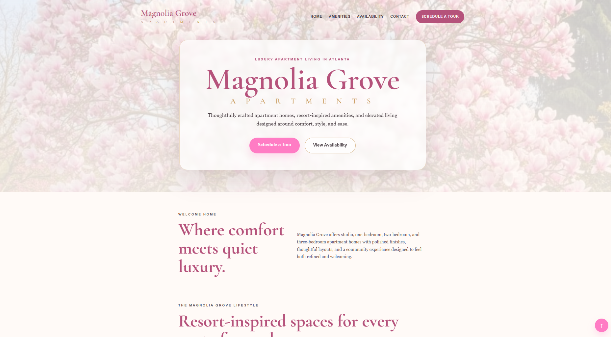
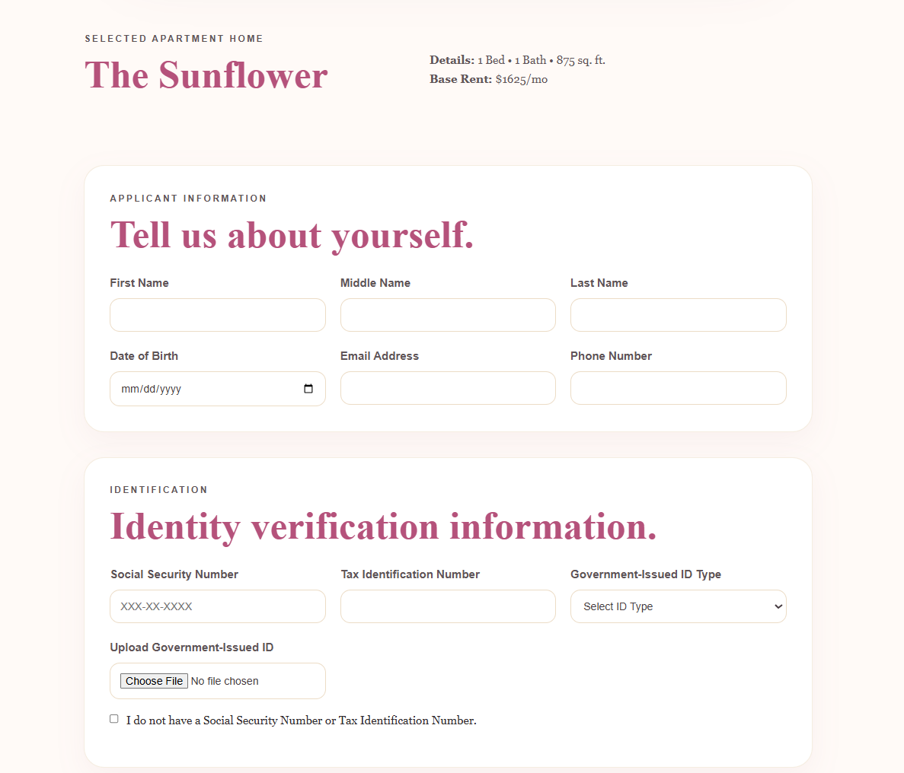

<p align="center">
  
</p>

<h1 align="center">✦ Magnolia Grove Apartments ✦</h1>

<p align="center">
<b>Software Engineering Portfolio Project • Luxury Apartment Leasing Experience</b>
</p>

<p align="center">
Simulating a modern apartment community website, resident screening process, and online rental application workflow.
</p>

<br/>

<p align="center">


</p>

---

## ✦ LIVE DEMO ✦

👉 https://angelacoreas1989-boop.github.io/apartment-application-portal/

---

## ✦ PROJECT OVERVIEW ✦

Magnolia Grove Apartments is a multi-page front-end web application designed to simulate a luxury apartment community website and leasing workflow.

The project combines marketing, apartment availability, resident screening requirements, pet policies, and a comprehensive rental application process into a single user experience.

The goal was to create a realistic property management application while strengthening software engineering fundamentals through practical development.

---

## ✦ BUSINESS PROBLEM ✦

Apartment communities need a streamlined process that allows prospective residents to:

- Explore apartment availability
- Learn about community amenities
- Review qualification requirements
- Understand pet policies and fees
- Submit rental applications
- Upload supporting documentation

Many apartment websites separate these functions across multiple systems.

Magnolia Grove was designed to simulate a more cohesive experience by bringing the leasing journey together in a single application.

---

## ✦ SOLUTION ✦

This project provides:

- Luxury apartment marketing website
- Apartment availability browsing
- Screening requirements page
- Pet policy information
- Dynamic rental application
- Vehicle registration workflow
- Pet registration workflow
- Document upload functionality
- Mobile-responsive design

The result is a realistic leasing experience that mirrors common workflows used throughout the property management industry.

---

## ✦ KEY FEATURES ✦

### Community Website

- Luxury Magnolia-themed branding
- Hero section with custom background image
- Community amenities
- Apartment features
- Featured apartment homes
- Availability search
- Contact information
- Schedule a Tour functionality

### Screening Requirements

- Income qualifications
- Occupancy guidelines
- Approval criteria
- Pet policies
- Pet fees
- Application requirements
- Screening disclosures

### Rental Application

- Applicant information
- Identity verification
- Residential history
- Employment history
- Income verification
- Emergency contacts
- Vehicle registration
- Pet registration
- ESA/Service Animal documentation
- File uploads
- Dynamic form functionality

### Apartment Availability

- Studio layouts
- One-bedroom layouts
- Two-bedroom layouts
- Three-bedroom layouts
- Availability filtering
- Featured floor plans

---

## ✦ TECHNOLOGY STACK ✦

<p align="center">
  
</p>

### Technologies Used

- HTML5
- CSS3
- JavaScript
- Git
- GitHub
- GitHub Pages

---

## ✦ SKILLS DEMONSTRATED ✦

- Responsive Web Design
- User Interface (UI) Design
- User Experience (UX) Principles
- Multi-Page Application Development
- Form Design & Organization
- Dynamic JavaScript Functionality
- DOM Manipulation
- URL Parameter Handling
- Front-End Architecture
- Git Version Control
- GitHub Pages Deployment
- Real-World Business Workflow Simulation

---

## ✦ PROJECT SCREENSHOTS ✦

### Luxury Community Homepage



**Highlights**

- Luxury apartment branding
- Magnolia-themed hero section
- Community marketing experience
- Apartment availability navigation

---

### Online Rental Application



**Highlights**

- Applicant information collection
- Identity verification workflow
- File upload functionality
- Dynamic application experience

---

## ✦ WHAT I LEARNED ✦

✦ Building large multi-page front-end applications

✦ Designing software around real-world leasing workflows

✦ Structuring complex application forms

✦ Managing dynamic user interactions with JavaScript

✦ Improving user experience through responsive design

✦ Organizing scalable project structures

✦ Deploying and maintaining applications with GitHub Pages

✦ Translating business processes into software solutions

---

## ✦ FUTURE ENHANCEMENTS ✦

✦ Interactive floor plan gallery

✦ Online tour scheduling system

✦ Application status tracking

✦ Resident portal

✦ Virtual apartment tours

✦ Lease generation workflow

✦ Online rent payment integration

✦ Administrative leasing dashboard

---

## ✦ PROJECT STRUCTURE ✦

```text
apartment-application-portal
│
├── assets
│   ├── angela-coreas-banner.png
│   ├── magnolia-tree.jpg
│   ├── magnolia-homepage.png
│   ├── magnolia-application.png
│   └── floorplans
│
├── index.html
├── screening.html
├── application.html
├── style.css
├── script.js
└── README.md
```

---

## ✦ AUTHOR ✦

### Angela Coreas

Software Engineering Student at WGU

**GitHub**  
https://github.com/angelacoreas1989-boop

**LinkedIn**  
https://www.linkedin.com/in/angela-coreas-550088186/

---

<p align="center">
Built with ❤️ while learning software engineering and creating real-world portfolio projects.
</p>
